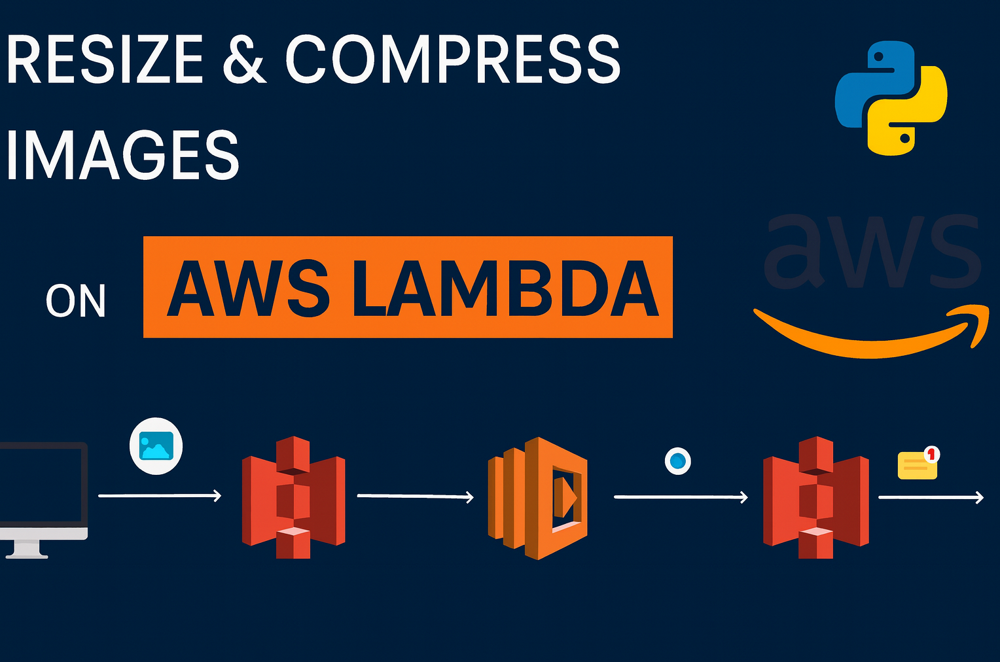
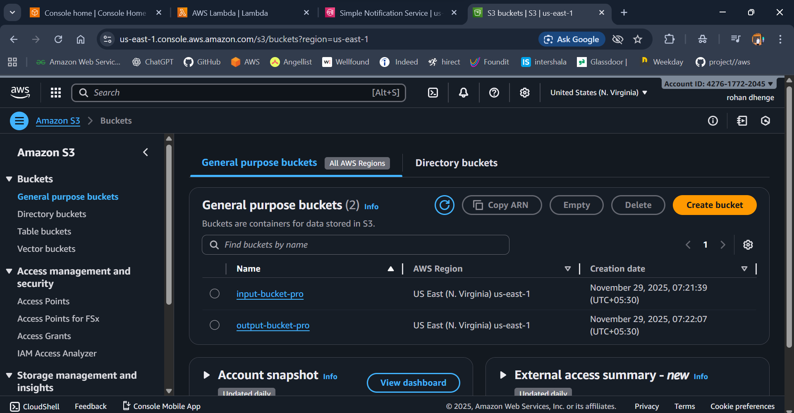
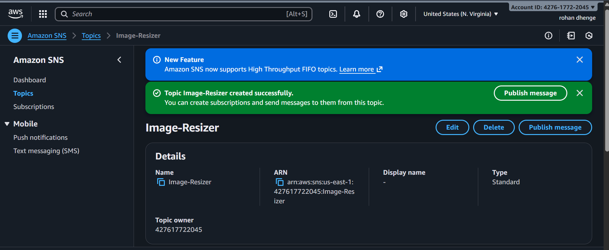
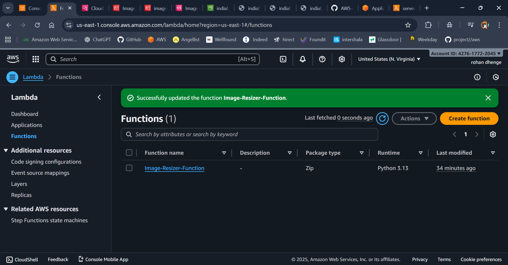

🚀 Serverless Image Processing Pipeline (AWS Lambda • S3 • SNS)

A fully serverless, event-driven image processing pipeline built on AWS. This solution automatically processes images upon upload and delivers optimized outputs with real-time notifications — all without managing any servers.

📌 Architecture Overview

Workflow:

A user uploads an image to the input S3 bucket.

An S3 event trigger invokes the AWS Lambda function.

Lambda performs:

Image resizing (three sizes: small, medium, large)

PDF generation (compressed)

Upload of output files to a destination S3 bucket

SNS notification for success or failure

SNS sends an SMS or email alert.

Components:

S3 (input-bkt-irs) – Source bucket for image uploads

AWS Lambda – Image processing logic

S3 (output-bkt-irs) – Stores resized JPGs and compressed PDF

SNS Topic – Sends processing status notifications

✨ Features 🖼 Intelligent Image Processing

Automatically generates optimized JPG versions:

300×300px — Small

600×600px — Medium

Reduces storage cost while maintaining clarity

🔔 Notification System (SNS)

Sends SMS/Email alerts

Includes success or detailed failure information

🧱 Fully Serverless Architecture

100% event-driven

Auto-scaling

No EC2 instances or manual provisioning required

📈 Production-Ready Build

Structured logging

Robust error handling

Principle of Least Privilege (IAM)

Highly scalable and extendable

1️⃣ Create S3 Buckets

input-bucket-pro

output-bucket-pro

2️⃣ Create SNS Topic

Name : Image-Resizer

Subscribe email or phone to receive notifications.

3️⃣ Create AWS Lambda Function

Runtime: Python 3.13

Memory: 1024 MB

Timeout: 180 seconds

Layers: Attach PillowLayerPython313

Environment Variables:

Key Value OUTPUT_BUCKET output=bucket-pro SNS_TOPIC_ARN arn:aws:sns:::image-processing-status 🔐 IAM Role Requirements

Attach to Lambda execution role:

AWSLambdaBasicExecutionRole

AmazonS3FullAccess (or a restricted S3 policy)

AmazonSNSFullAccess

4️⃣ Add S3 Trigger

Service: S3

Bucket: input-bkt-irs

Event Type: PUT (Object Created)

Enable Trigger

🧪 Testing the Pipeline

Upload a img

input-bucket-pro

Expected outputs in output-bkt-irs:
 

 
